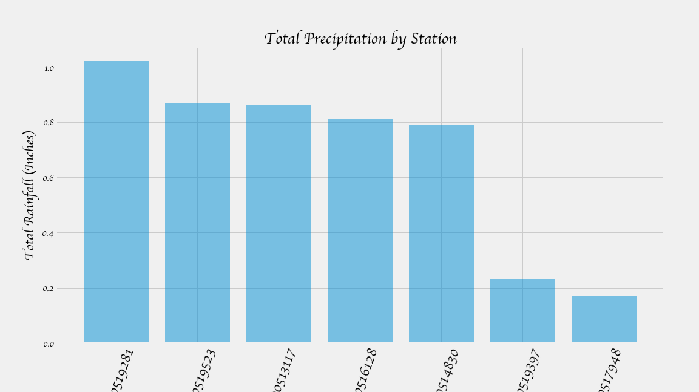

<h1 align=center> Climate Analysis and Exploration </h1>

* This project used Python and SQLAlchemy, an ORM, to do a basic analysis of a SQLite database containing climate data.  
* The development was conducted in _climate_analysis.ipynb_ (Jupyter Notebook), and the application was completed in _climate_app.py_.  
* The python file utilizes flask routing and templating to display a few results from the analysis.  
* The main python packages which were used are Pandas, MatPlotlib & Numpy, flask, & SQLAlchemy.  
* Charts were generated during this analysis and are provided below.  
* The following is a basic breakdown of the analysis portion completed in Jupyter notebook:

## Precipitation Analysis
Query & Save the last 12 months of precipitation data and plot the results (Pandas).
  
  

## Station Analysis
Query the annual temperature observation data for the most active station, and plot the results as histogram (Numpy, Pandas). 
  
  

## Temperature Analysis 
Given user input, use the predefined 'calc_temps' function to determine minimum, average, and maximum expected temperatures during the trip duration:¶
  
  

## Rainfall Analysis
Calculate the rainfall per weather station using the previous year's matching dates.
  
  

## Daily Normal Expectation Analysis
Calculate the daily normals for the trip duration
  
  

#### Copyright
Data Boot Camp ©2018. All Rights Reserved.
